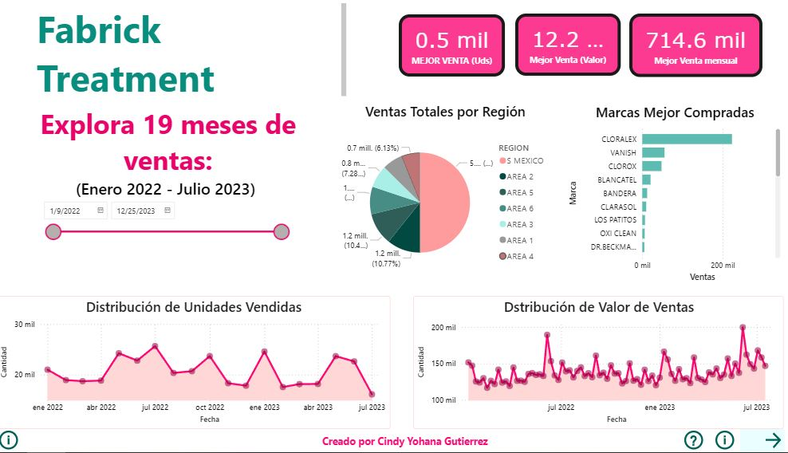
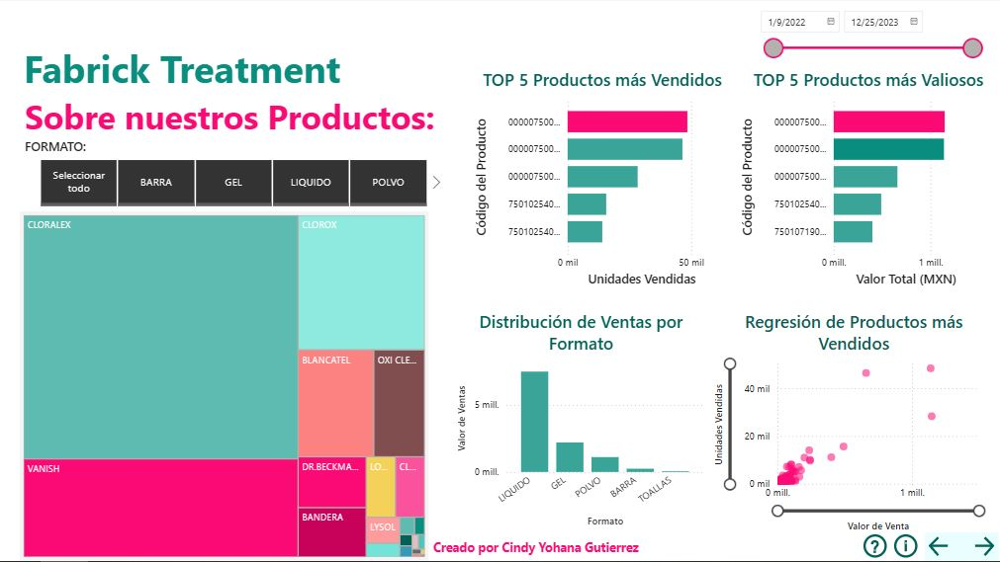

# 📊 Proyecto: Análisis de Ventas de Limpiadores de Tela  

### 🎯 Objetivo  
Desarrollar un dashboard interactivo en Power BI que muestre las ventas de productos de limpieza de tela a lo largo de **1 año y medio (enero 2022 – julio 2023)**. El propósito es analizar tendencias, identificar marcas líderes y explorar insights por región y formato.  

### 🖼️ Vista previa :

### Link del Dashboard interactivo:
https://app.powerbi.com/reportEmbed?reportId=3912b65b-e1d7-4794-87a1-47743abf26df&autoAuth=true&ctid=53e0f663-6802-4124-8200-fd801cb6141c&actionBarEnabled=true

### 📂 Origen de los datos  
- Fuente: Datos proporcionados por la empresa  
- Periodo: 19 meses (enero 2022 – julio 2023)  
- Variables principales: Fecha, Región, Marca, Formato de producto, Ventas por unidades y por valor, códigos de proucto, etc

#### 📑 Estructura del Dashboard  

#### 🔹 Página Narrativa  
Cuenta la historia de las ventas a lo largo del periodo:  
- **Botones principales**: mejores ventas por unidad, por valor y mejor mes  
- **Slicer de tiempo**: permite explorar insights dinámicos  
- **Gráficas de participación regional**: muestran el porcentaje de ventas por región, con interactividad para filtrar otras visualizaciones  
- **Barras horizontales**: destacan las marcas más vendidas, con interactividad para observar variabilidad y estabilidad en el tiempo  
- **Tendencias de varianza**: gráficos de línea muestran la evolución de ventas por unidad y por valor, resaltando momentos de divergencia  

#### 🔹 Página Explorativa  
Análisis a nivel de formato y producto:  
- **Slicer de formato**: permite segmentar por presentación del producto  
- **Productos más vendidos vs. mayor valor económico**: comparación que revela que no siempre coinciden  
- **Scatter plot con regresión**: permite identificar **outliers** relevantes. Los slicers ayudan a explorar productos con alto valor o ventas en diferentes escalas  

#### 🔹 Página Tablas  
Un espacio para el análisis más profundo, con tablas dinámicas que permiten a los usuarios curiosos generar sus propios insights  

### 💡 Insights destacados  
- Diferencias claras entre los productos más vendidos en unidades y los de mayor valor económico  
- Identificación de outliers importantes que aportan significativamente al valor de ventas  
- Variaciones regionales en participación de mercado que influyen en la distribución global  
- Tendencias temporales que sugieren momentos de crecimiento o decrecimiento estacional  

### 🛠️ Metodología y herramientas  
- **Power Query**: limpieza y preparación de datos  
- **DAX**: creación de medidas personalizadas para análisis de ventas y valor  
- **Visualizaciones interactivas en Power BI**: slicers, KPI cards, scatter plots, gráficos de barras y líneas  
- **Storytelling con datos**: diseño de páginas narrativas, explorativas y analíticas.

### 🚀 Cómo usar este proyecto

Descarga el archivo .pbix desde la carpeta /dashboards

Ábrelo en Power BI Desktop

Explora las tres páginas interactivas (Narrativa, Explorativa y Tablas)

### 👩‍💻 Acerca de mí

Soy Cientifica de Datos Junior con experiencia en análisis y visualización de información, por supuesto, me encanta Power BI por su dinamismo y arte. Me interesa conectar la claridad analítica con el storytelling visual, facilitando la toma de decisiones a partir de datos.
Sientete librede colaborar mejoras para este proyecto.
